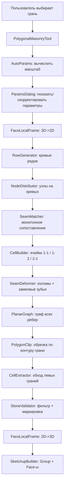

# Архитектура плагина «Рядная полигональная кладка» для SketchUp

## Обзор

Плагин генерирует рядную полигональную кладку (в стиле древних циклопических стен) на выбранной плоской грани SketchUp. Результат — набор Face-объектов внутри Group, покрывающих всю поверхность без зазоров и наложений, с замковыми камнями и перевязкой рядов.

---

## Структура файлов

```
polygonal_masonry/
├── polygonal_masonry.rb          # Точка входа: регистрация расширения, меню
├── core/
│   ├── face_local_frame.rb       # 3D ↔ 2D преобразования координат
│   ├── row_generator.rb          # Генерация волнистых рядовых кривых
│   ├── node_distributor.rb       # Расстановка узлов на кривых
│   ├── seam_matcher.rb           # Монотонное сопоставление узлов соседних рядов
│   ├── seam_deformer.rb          # Деформация швов: изломы и замковые зубья
│   ├── cell_builder.rb           # Построение полигонов ячеек из интервалов
│   ├── planar_graph.rb           # Планарный граф рёбер
│   ├── cell_extractor.rb         # Извлечение замкнутых ячеек из планарного графа
│   ├── stone_validator.rb        # Фильтрация и маркировка камней
│   ├── auto_params.rb            # Автовыбор масштаба и параметров
│   └── sketchup_builder.rb       # Запись геометрии в модель SketchUp
├── ui/
│   ├── toolbar.rb                # Тулбар с кнопкой запуска
│   └── params_dialog.rb          # Диалог параметров (UI.inputbox или HtmlDialog)
└── utils/
    ├── geom2d.rb                 # Вспомогательная 2D-геометрия
    ├── polygon_clip.rb           # Обрезка полигонов по контуру (Sutherland-Hodgman)
    └── random_seeded.rb          # Воспроизводимый генератор случайных чисел
```

---

## Архитектурная схема (поток данных)



---

## Описание модулей

### `polygonal_masonry.rb`
- Регистрирует расширение (`SketchupExtension`)
- Добавляет пункт меню `Extensions > Polygonal Masonry`
- Создаёт экземпляр `PolygonalMasonryTool` и активирует его

---

### `core/face_local_frame.rb` — `FaceLocalFrame`

**Ответственность:** двунаправленное преобразование координат между 3D-пространством SketchUp и локальной 2D-плоскостью грани.

```ruby
class FaceLocalFrame
  def initialize(face)           # строит оси u, v, origin из normal грани
  def to_2d(pt3d)  → [x, y]     # Geom::Point3d → [Float, Float]
  def to_3d(x, y) → Geom::Point3d
  def face_loop_2d → [[x,y],…]  # внешний контур в 2D
  def bbox_2d      → {xmin,xmax,ymin,ymax}
end
```

**Детали реализации:**
- Ось `u` = первое ребро грани, нормализованное
- Ось `v` = `normal × u`, нормализованное
- `origin` = первая вершина внешнего контура
- Точность: все операции через `Geom::Vector3d`

---

### `utils/geom2d.rb` — `Geom2D`

Минимальный набор 2D-примитивов (без внешних зависимостей):

```ruby
module Geom2D
  def self.lerp(a, b, t)                      # линейная интерполяция точек [x,y]
  def self.segment_intersect(p1,p2,p3,p4)     # → [x,y] или nil
  def self.point_in_polygon?(pt, polygon)      # ray-casting
  def self.polygon_area(pts)                  # знаковая площадь (Shoelace)
  def self.polygon_centroid(pts)
  def self.min_interior_angle(pts)            # минимальный внутренний угол
  def self.offset_polygon(pts, d)             # простой inset (для шва)
  def self.polyline_y_at_x(segments, x)       # интерполяция y по x на ломаной
  def self.sort_by_angle(pts, center)         # сортировка по полярному углу
end
```

---

### `core/auto_params.rb` — `AutoParams`

**Ответственность:** автоматический выбор эстетически подходящих параметров исходя из размеров грани.

```ruby
class AutoParams
  TARGET_STONE_COUNT_RANGE = 30..120   # целевое число камней
  ASPECT_RATIO_IDEAL       = 1.4       # идеальное соотношение ш:в камня
  KEY_STONE_RATIO          = 0.20      # доля замковых камней

  def initialize(bbox2d)
  def compute → Hash                   # возвращает полный params Hash
end
```

**Алгоритм автомасштаба:**
1. Вычислить площадь грани `S = width * height` (приближённо по bbox)
2. Целевая площадь одного камня: `stone_area = S / target_count` (target ≈ 60)
3. `stone_height = sqrt(stone_area / ASPECT_RATIO_IDEAL)`
4. `stone_width  = stone_area / stone_height`
5. Количество рядов `n_rows = height / stone_height`, округлить
6. Пересчитать `row_height_mean = height / n_rows`
7. Амплитуда волны ряда: `row_curve_amplitude = row_height_mean * 0.12`
8. Замковый зуб: `key_tooth_depth = stone_width * 0.15`
9. `joint_width = min(stone_width, stone_height) * 0.015` (≥ 5mm)

---

### `core/row_generator.rb` — `RowGenerator`

**Ответственность:** генерировать `n+1` почти горизонтальных монотонных кривых рядов внутри bbox.

```ruby
class RowGenerator
  def initialize(bbox2d, params, rng)
  def build_rows → Array[RowCurve]   # снизу вверх

  RowCurve = Struct.new(:y_samples)  # Array [[x, y], ...]
end
```

**Алгоритм:**
1. Стартовая кривая: `y = ymin` (прямая линия по нижнему краю)
2. Для каждого следующего ряда:
   - `delta_y = row_height_mean + jitter(-row_height_jitter, +row_height_jitter)`
   - Базовая `y_base = prev_y_base + delta_y`
   - Если `y_base > ymax` — стоп
   - Синусоидальное искажение: `y(x) = y_base + amplitude * sin(2π*x/wavelength + phase)`
   - `phase` — случайный сдвиг фазы
3. Последняя кривая: `y = ymax` (прямая по верхнему краю)
4. Проверка: каждая кривая строго выше предыдущей с зазором `>= min_stone_height`

**Кривая хранится** как массив `[[x0,y0], [x1,y1], ...]` с шагом ≈ `stone_width/4` по x (≈ 30–60 сэмплов на bbox-ширину).

---

### `core/node_distributor.rb` — `NodeDistributor`

**Ответственность:** расставить узлы деления на каждой кривой ряда.

```ruby
class NodeDistributor
  def initialize(rows, bbox2d, params, rng)
  def distribute → Array[Array[Node]]   # [row_idx] → [Node, ...]

  Node = Struct.new(:x, :y)            # точка на кривой ряда
end
```

**Алгоритм:**
1. Для каждой кривой ряда:
   - Начать с `x = xmin`
   - Накапливать `x += stone_width_mean + jitter(-stone_width_jitter, +stone_width_jitter)`
   - Добавлять `Node(x, curve.y_at(x))` пока `x < xmax`
   - Конечная точка `x = xmax` всегда добавляется
2. Узлы соседних рядов смещены относительно друг друга примерно на `stone_width/2` (фаза начального сдвига)
3. Минимальное расстояние между соседними узлами: `min_edge`

---

### `core/seam_matcher.rb` — `SeamMatcher`

**Ответственность:** построить монотонное бесперекрёстное соответствие между узлами соседних рядов.

```ruby
class SeamMatcher
  def initialize(rows, row_nodes, params, rng)
  def match_all → Array[Array[SeamLink]]   # [band_idx] → [SeamLink, ...]

  SeamLink = Struct.new(:top_node, :bottom_node, :kind)
  # kind: :normal, :one_to_two, :two_to_one
end
```

**Алгоритм (merge-проход):**

```
Для каждой полосы band[k] между row[k] и row[k+1]:
  top_xs    = узлы row[k]    (отсортированы по x)
  bottom_xs = узлы row[k+1]  (отсортированы по x)

  Строим интервалы:
    top_intervals    = [[t0,t1], [t1,t2], ...]
    bottom_intervals = [[b0,b1], [b1,b2], ...]

  Merge-проход слева направо:
    Пока есть интервалы в обоих списках:
      Смотрим на правый край текущего top и bottom
      Выбираем режим:
        :one_to_one  — правые края примерно совпадают → 1 камень, оба продвигаются
        :one_to_two  — top_right далеко справа → один top накрывает 2 bottom
        :two_to_one  — bottom_right далеко справа → 2 top на 1 bottom
      Вероятности: 60% one_to_one, 20% one_to_two, 20% two_to_one
      Корректируем с учётом min/max ширины камня
```

Результат: список `CellSpec { top_range: i..j, bottom_range: m..n }` для каждого камня в полосе.

---

### `core/cell_builder.rb` — `CellBuilder`

**Ответственность:** из `CellSpec` построить первичный полигон камня (до деформации).

```ruby
class CellBuilder
  def initialize(rows, row_nodes, params, rng)
  def build_cells(band_idx, cell_specs) → Array[StoneCell]

  StoneCell = Struct.new(:points2d, :kind, :band, :top_range, :bottom_range)
end
```

**Геометрия обычного камня (one_to_one):**

```
Вход: top_interval [t_i, t_{i+1}], bottom_interval [b_j, b_{j+1}]
Точки по часовой стрелке (наружная нормаль вверх):

  p_tl = [t_i.x,   top_curve.y_at(t_i.x)]
  p_tr = [t_{i+1}.x, top_curve.y_at(t_{i+1}.x)]
  p_br = [b_{j+1}.x, bot_curve.y_at(b_{j+1}.x)]
  p_bl = [b_j.x,   bot_curve.y_at(b_j.x)]

  Для «полигональности» добавить боковые изломы:
    left_mid_x  = lerp(t_i.x, b_j.x, 0.5) + seam_jitter * rand(-1..1)
    left_mid_y  = (p_tl[1] + p_bl[1]) / 2 + seam_jitter * rand(-0.3..0.3)
    right_mid_x = lerp(t_{i+1}.x, b_{j+1}.x, 0.5) + seam_jitter * rand(-1..1)
    right_mid_y = (p_tr[1] + p_br[1]) / 2 + seam_jitter * rand(-0.3..0.3)

  Итого 6 точек: [p_tl, p_tr, right_mid, p_br, p_bl, left_mid]
```

**Геометрия one_to_two / two_to_one:**
- one_to_two: верхний интервал один, нижних два → 7 точек (верх: 2, низ: 3 узла)
- two_to_one: верхних два, нижний один → 7 точек (верх: 3, низ: 2 узла)

---

### `core/seam_deformer.rb` — `SeamDeformer`

**Ответственность:** деформировать общие границы между камнями — добавлять замковые зубья.

```ruby
class SeamDeformer
  def initialize(cells_by_band, params, rng)
  def deform_all → Array[StoneCell]   # модифицированные камни
end
```

**Алгоритм замкового зуба:**

1. Для каждой вертикальной границы между двумя соседними камнями в одной полосе:
   - С вероятностью `key_stone_ratio` (~20%) делаем зуб
   - Вычисляем «коридор»: расстояние до соседних швов слева и справа
   - Допустимая амплитуда зуба: `min(corridor_left, corridor_right) * 0.4`
   - Если `amplitude < key_tooth_depth_min` → пропускаем

2. Геометрия зуба (на левой боковой грани камня A — правой камня B):
   ```
   Исходная граница: [top_pt, mid_pt, bot_pt]  (ломаная из 3 точек)

   Замена mid_pt на зуб:
     direction = random choice (:left или :right)
     tooth_x   = mid_pt[0] + amplitude * direction_sign
     tooth_top = [lerp(top_pt[0], tooth_x, 0.7), lerp(top_pt[1], mid_pt[1], 0.4)]
     tooth_bot = [lerp(bot_pt[0], tooth_x, 0.7), lerp(bot_pt[1], mid_pt[1], 0.4)]

   Новая граница: [top_pt, tooth_top, [tooth_x, mid_pt[1]], tooth_bot, bot_pt]
   ```

3. Применить деформацию симметрично к обоим смежным камням (разделяемая граница)

4. Перепроверить: нет самопересечений, нет пересечений с соседними швами

---

### `core/planar_graph.rb` — `PlanarGraph`

**Ответственность:** хранить все рёбра как планарный граф с топологическими связями.

```ruby
class PlanarGraph
  def add_segment(p1, p2)          # добавить отрезок (с разбиением в точках пересечения)
  def add_polyline(pts)            # добавить ломаную
  def add_polyline_clipped(pts, boundary)  # добавить, обрезав по контуру
  def vertices → Array[Vertex]
  def half_edges → Array[HalfEdge]

  Vertex   = Struct.new(:pt, :out_edges)   # [x,y], исходящие полурёбра
  HalfEdge = Struct.new(:origin, :twin, :next, :face)
end
```

**Ключевые операции:**
- При добавлении сегмента: проверять пересечения со всеми существующими рёбрами и разбивать в точках пересечения
- Точки считаются совпадающими при расстоянии `< EPSILON = 1e-6` (в единицах inches SketchUp)
- Для каждой вершины сортировать исходящие полурёбра по полярному углу

---

### `utils/polygon_clip.rb` — `PolygonClip`

**Ответственность:** обрезка полилиний и полигонов по контуру грани.

```ruby
module PolygonClip
  def self.clip_polyline_by_polygon(polyline_pts, boundary_pts) → Array[Array[pt]]
    # Sutherland-Hodgman для линий: возвращает массив сегментов внутри boundary
  
  def self.clip_polygon_by_polygon(subject_pts, clip_pts) → Array[pt]
    # Sutherland-Hodgman полного полигона
  
  def self.intersect_segment_polygon(p1, p2, boundary) → Array[[x,y]]
    # все точки пересечения отрезка с рёбрами boundary
end
```

---

### `core/cell_extractor.rb` — `CellExtractor`

**Ответственность:** обходить планарный граф и извлекать все внутренние грани (ячейки-камни).

```ruby
class CellExtractor
  def initialize(planar_graph)
  def extract_faces → Array[Array[pt2d]]  # каждый элемент — замкнутый полигон

  private
  def traverse_left_face(start_half_edge) → Array[pt2d]
  def find_outer_face → face_id
end
```

**Алгоритм обхода левых граней:**
1. Для каждого непосещённого полуребра `he`:
   - Обходим цикл: `he → he.next → he.next.next → ...` до возврата к `he`
   - Собираем `he.origin.pt` в массив
   - Помечаем полуребро как посещённое
2. Найти и отбросить внешнюю «бесконечную» грань (наибольшая площадь или площадь < 0)
3. Остальные грани — камни

---

### `core/stone_validator.rb` — `StoneValidator`

**Ответственность:** проверять и маркировать камни, отбрасывать дефектные.

```ruby
class StoneValidator
  def initialize(params)
  def filter_and_repair(cells) → Array[ValidatedStone]

  ValidatedStone = Struct.new(:points2d, :kind, :area, :centroid)
  # kind: :normal, :key, :edge, :small (отброшен)
end
```

**Критерии отбраковки:**
| Критерий | Порог |
|----------|-------|
| Минимальная площадь | `min_area` (авто: ≈ 0.08 m²) |
| Минимальный внутренний угол | `min_angle_deg` (28°) |
| Максимальное соотношение сторон bbox | 5:1 |
| Самопересечение | → всегда отброс |
| Менее 3 вершин | → всегда отброс |

**Маркировка `kind: :key`:**
- Отношение ширины сверху к ширине снизу < 0.85 или > 1.15
- И боковая асимметрия > порога (центроид смещён от середины bbox более чем на 15%)

**Маркировка `kind: :edge`:**
- Хотя бы одно ребро лежит на внешнем контуре грани

---

### `core/sketchup_builder.rb` — `SketchupBuilder`

**Ответственность:** создавать финальную геометрию в модели SketchUp.

```ruby
class SketchupBuilder
  def initialize(face, frame, params)
  def build(validated_stones)
    # 1. Создать Group внутри той же Entities
    # 2. model.start_operation('Polygonal Masonry', true)
    # 3. Для каждого камня:
    #    a. Преобразовать points2d → [Geom::Point3d, ...]
    #    b. entities.add_face(pts3d)  -- создаёт Face
    #    c. Назначить материал по kind (:key → другой цвет)
    # 4. model.commit_operation
  end
end
```

**Особенности:**
- Исходная грань удаляется (`face.erase!`) после построения группы
- Все рёбра создаются через `add_face`, SketchUp сам создаёт рёбра
- При создании дублирующихся рёбер SketchUp не создаёт новых — это нормально
- После создания всех граней вызвать `group.entities.purge_unused`
- Опционально: если `joint_width > 0`, применить `offset_polygon` к каждому камню перед построением

---

### `ui/params_dialog.rb` — `ParamsDialog`

```ruby
class ParamsDialog
  def initialize(auto_params)
  def show → Hash или nil   # nil = пользователь нажал Cancel
end
```

Использует `UI.inputbox` (простой вариант для MVP) или `UI::HtmlDialog` (для v3).

**Отображаемые параметры:**
| Параметр | Единица | Подсказка |
|----------|---------|-----------|
| Высота ряда (среднее) | mm | Средняя высота одного ряда камней |
| Ширина камня (среднее) | mm | Средняя ширина одного камня |
| Разброс высоты ряда | mm | ±джиттер высоты |
| Разброс ширины камня | mm | ±джиттер ширины |
| Доля замковых камней | % | 0–40% |
| Глубина замкового зуба | mm | Выступ замкового шва |
| Ширина шва | mm | 0 = только линии |
| Seed (зерно) | — | Для воспроизводимости |

---

## Корректировки алгоритма

### 1. Гарантия рядов (требование №1)

**Проблема:** чистый Voronoi не сохраняет ряды.  
**Решение:** RowGenerator строит строго монотонные кривые (y всегда возрастает снизу вверх). Каждая ячейка принадлежит ровно одной полосе между двумя соседними кривыми. Горизонтальное визуальное восприятие рядов гарантировано геометрически.

### 2. Замковые камни (требование №2)

**Уточнение алгоритма:**  
Замковые камни реализуются на **двух уровнях**:

- **Уровень 1 — топология (SeamMatcher):** режимы `one_to_two` и `two_to_one` создают камни, у которых верхняя и нижняя ширина не совпадают. Это структурная замковость.
- **Уровень 2 — геометрия (SeamDeformer):** зубья на боковых швах создают интерлокинг соседних камней в одной полосе. Это визуальная замковость.

Итого до ~35% камней имеют выраженный замковый характер.

### 3. Обрезка по границам (требование №3)

**Уточнение:** граничные камни обрезаются через `PolygonClip.clip_polygon_by_polygon`. Граница грани добавляется как внешний контур в `PlanarGraph`. Рёбра, выходящие за контур, отбрасываются при `add_polyline_clipped`. Камни, частично выходящие за контур, получают дополнительные вершины на границе.

### 4. Отсутствие зазоров (требование №4)

**Гарантия:** все камни строятся из **общих** точек границ (Node на RowCurve). Одна точка узла ряда является концом сразу нескольких рёбер. Никакой случайной вставки отдельных полигонов — только единый планарный граф.

### 5. Отсутствие наложений (требование №5)

**Гарантия:** `PlanarGraph` при добавлении рёбра проверяет пересечения и разбивает рёбра. `CellExtractor` работает с корректной HalfEdge-структурой, где каждое ребро принадлежит ровно двум граням. Наложения топологически невозможны.

### 6. Автомасштаб (требование №6)

`AutoParams` вычисляет параметры из площади и пропорций грани. Целевой диапазон: 30–120 камней. Если пользователь не меняет параметры, плагин сам выбирает эстетически сбалансированный масштаб.

---

## Итерационный план реализации

### Итерация 1 — MVP (базовая кладка)

**Цель:** видимый результат, правильная топология, без сложных деформаций.

- [ ] `face_local_frame.rb` — 3D↔2D
- [ ] `utils/geom2d.rb` — базовая геометрия
- [ ] `row_generator.rb` — прямые ряды (без синуса)
- [ ] `node_distributor.rb` — равномерные узлы со сдвигом
- [ ] `cell_builder.rb` — только режим `one_to_one`, 4-угольники
- [ ] `utils/polygon_clip.rb` — обрезка по bbox (не по произвольному контуру)
- [ ] `sketchup_builder.rb` — создание рёбер и граней напрямую (без PlanarGraph)
- [ ] `polygonal_masonry.rb` — меню и запуск
- **Результат:** прямоугольная грань разбивается на трапецеидальные камни с перевязкой

### Итерация 2 — Полигональность и замки

**Цель:** реалистичная полигональная форма, замковые элементы.

- [ ] `row_generator.rb` — синусоидальные волны
- [ ] `cell_builder.rb` — режимы `one_to_two`, `two_to_one`, боковые изломы
- [ ] `seam_matcher.rb` — вероятностный merge-проход
- [ ] `seam_deformer.rb` — замковые зубья
- [ ] `auto_params.rb` — автоматический масштаб
- [ ] `stone_validator.rb` — фильтрация плохих камней
- [ ] `ui/params_dialog.rb` — диалог параметров
- **Результат:** убедительная полигональная кладка на прямоугольных гранях

### Итерация 3 — Произвольный контур и доработки

**Цель:** произвольные грани, реальные швы, UI.

- [ ] `planar_graph.rb` — HalfEdge структура
- [ ] `cell_extractor.rb` — обход левых граней
- [ ] `polygon_clip.rb` — полный Sutherland-Hodgman
- [ ] `sketchup_builder.rb` — реальный offset для швов
- [ ] `ui/toolbar.rb` — тулбар
- [ ] `ui/params_dialog.rb` — HtmlDialog с превью
- [ ] Поддержка граней с отверстиями
- **Результат:** полнофункциональный плагин для любых плоских граней

---

## Параметры по умолчанию (автовычисляются)

```ruby
DEFAULT_PARAMS = {
  row_height_mean:       900.mm,
  row_height_jitter:     250.mm,
  stone_width_mean:      1200.mm,
  stone_width_jitter:    400.mm,
  row_curve_amplitude:   110.mm,
  row_curve_wavelength:  3000.mm,
  seam_jitter:           140.mm,
  key_stone_ratio:       0.20,
  key_tooth_depth:       180.mm,
  key_tooth_depth_min:   60.mm,
  min_edge:              120.mm,
  min_area:              0.06.m2,
  min_angle_deg:         26.0,
  joint_width:           0.mm,      # 0 = только линии (режим A)
  one_to_one_prob:       0.60,
  one_to_two_prob:       0.20,
  two_to_one_prob:       0.20,
  seed:                  nil        # nil = случайный
}
```

---

## Технические ограничения SketchUp

| Ограничение | Решение |
|-------------|---------|
| Минимальная геометрия ~1mm | `min_edge >= 5.mm` в продакшне |
| Нет нативного 2D-движка | Все вычисления на чистом Ruby в Float |
| Медленная запись геометрии | `start_operation(disable_ui: true)` |
| Дублирующиеся рёбра | SketchUp игнорирует (используем это) |
| Нет нативного planar graph | Реализуем свой минимальный |
| Коплановые грани объединяются | Работаем только с 2D-Face |

---

## Диаграмма классов

```mermaid
classDiagram
    class PolygonalMasonryTool {
        +activate()
        +onLButtonUp(flags, x, y, view)
    }
    class FaceLocalFrame {
        +to_2d(pt3d)
        +to_3d(x, y)
        +face_loop_2d()
        +bbox_2d()
    }
    class AutoParams {
        +compute() Hash
    }
    class RowGenerator {
        +build_rows() Array
    }
    class NodeDistributor {
        +distribute() Array
    }
    class SeamMatcher {
        +match_all() Array
    }
    class CellBuilder {
        +build_cells(band, specs) Array
    }
    class SeamDeformer {
        +deform_all() Array
    }
    class PlanarGraph {
        +add_polyline_clipped(pts, boundary)
        +half_edges() Array
    }
    class CellExtractor {
        +extract_faces() Array
    }
    class StoneValidator {
        +filter_and_repair(cells) Array
    }
    class SketchupBuilder {
        +build(stones)
    }

    PolygonalMasonryTool --> FaceLocalFrame
    PolygonalMasonryTool --> AutoParams
    PolygonalMasonryTool --> RowGenerator
    PolygonalMasonryTool --> NodeDistributor
    PolygonalMasonryTool --> SeamMatcher
    PolygonalMasonryTool --> CellBuilder
    PolygonalMasonryTool --> SeamDeformer
    PolygonalMasonryTool --> PlanarGraph
    PolygonalMasonryTool --> CellExtractor
    PolygonalMasonryTool --> StoneValidator
    PolygonalMasonryTool --> SketchupBuilder
```


